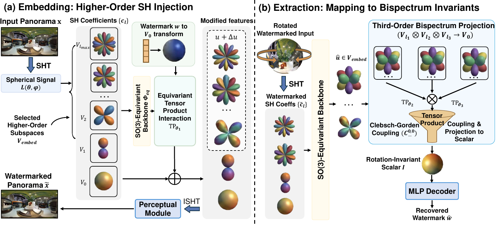

# TRIAD

**Rotation-Invariant Spherical Watermarking via Third-Order SO(3) Representation Coupling**  

**ICML 2026**

Pengzhen Chen, Yanwei Liu, Xiaoyan Gu, Antonios Argyriou, Wu Liu, Weiping Wang

🤗 **Hugging Face model:** [JERCCC/TRIAD](https://huggingface.co/JERCCC/TRIAD)

TRIAD embeds binary watermarks into panoramic images using spherical harmonic

representations and recovers them through third-order SO(3) invariant coupling.

This repository provides the model, training, rotation and conventional distortion

evaluation, and an interactive ERP-to-sphere rotation demo.

[Installation](#installation) | [Pretrained model](#pretrained-model) |

[Evaluation](#evaluation) | [Training](#training) |

[Interactive demo](#interactive-demo)



The release contains the 32-bit model used by the authors' current test script.

Its native input is **256 x 512 RGB ERP**, with `lmax=16` and embedding degrees

`{6, 8, 14}`. The paper reports evaluation at 512 x 1024; this release does not

silently resize checkpoint buffers or claim that its default command reproduces

every paper table. See [reproducibility notes](docs/REPRODUCIBILITY.md).

## Installation
```bash

conda create -n triad python=3.10 -y

conda activate triad

pip install -r requirements.txt

pip install -e .

```

PyTorch 2.7.0, torchvision 0.22.0, and e3nn 0.5.9 are the tested versions.

Use a PyTorch build appropriate for your GPU driver, or use `--device cpu`.

The native model is large; a CUDA GPU is recommended. The visualization assets

are included locally and require no CDN access or Node.js installation.

## Pretrained Model
Weights are distributed separately from GitHub, under the MIT license.

The pretrained weights are available on Hugging Face at [JERCCC/TRIAD](https://huggingface.co/JERCCC/TRIAD).

Download `model.pt`, `config.json`, and `manifest.json` into:

```text

checkpoints/triad-32bit/

  model.pt

  config.json

  manifest.json

```

Download the released checkpoint directly from Hugging Face:

```bash

pip install -e '.[hub]'

python scripts/download_checkpoint.py --repo-id JERCCC/TRIAD

```

All entry points also accept `--checkpoint /path/to/checkpoint_epoch_300.pth`

for an original training checkpoint. Loading is strict: incompatible weights fail

instead of leaving randomly initialized parameters in the model.

## Data
Arrange your own licensed ERP images as follows:

```text

data/

  train/

  val/

  test/

```

The paper uses PanoContext and SUN360. Dataset images are not redistributed.

Files are recursively sorted, converted to RGB, resized to the checkpoint's

native resolution, and normalized to `[-1, 1]`. Unreadable files cause an error;

they are never replaced by synthetic images. Optional manifests contain one

image path relative to the data root per line. Exact original dataset splits

are not included in this release.

## Evaluation
Run the full test suite on ten images:

```bash

python evaluate.py --checkpoint checkpoints/triad-32bit \\

  --data-dir data/test --suite all --num-images 10 --num-rotations 10 \\

  --output-dir outputs/all --save-images

```

Rotation-only and traditional distortion tests:

```bash

python evaluate.py --data-dir data/test --suite rotation \\

  --num-images 100 --num-rotations 10 --output-dir outputs/rotation

python evaluate.py --data-dir data/test --suite traditional \\

  --num-images 100 --output-dir outputs/traditional

```

Angle sweep with uniformly sampled axes, as described in the paper's rotation figure:

```bash

python evaluate.py --data-dir data/test --suite rotation \\

  --angles 0 30 60 90 120 150 180 --num-rotations 1000 \\

  --num-images 10 --output-dir outputs/angle_sweep

```

`--num-images 0` evaluates all images. Every output directory must be new/empty.

Results include `results.json` (settings, quality metrics and aggregates),

`per_image.csv` (each trial), and `traces.json` (watermarks and rotation matrices).

BER is the fraction of incorrect bits; bit accuracy is `1 - BER`.

The default `--rotation-sampler legacy` preserves the original research sampler.

For geometric identity preservation and wrapped longitude interpolation, use

`--rotation-sampler spherical`. These are distinct protocols; always retain the

sampler in reported results. `--png-roundtrip` evaluates saved 8-bit pixel values;

the default evaluates floating-point tensors, matching the research test.

The traditional suite contains JPEG, Gaussian blur/noise, median filtering,

salt-and-pepper noise, resize, brightness, contrast, hue, saturation, cropout,

edge crop/resize, and edge blackout. `--suite combined` runs cropout + SO(3) and

Gaussian blur + SO(3). Full parameters are listed in

[evaluation notes](docs/EVALUATION.md).

## Training
Train from scratch with the paper-described loss schedule:

```bash

python train.py --config configs/paper.json \\

  --data-dir data/train --val-dir data/val --output-dir runs/paper

```

This uses Adam, learning rate `1e-4`, 300 epochs, 32 bits, and

`lambda_BCE=10`; the MSE weight increases from 1 to 20 during epochs 101-200.

The native training resolution here is 256 x 512, taken from the released

checkpoint; the paper's explicit 512 x 1024 resolution concerns evaluation.

The effective objective in the supplied current fine-tuning script is separately

available as `configs/current_finetune.json` (`200*MSE + BCE`, AdamW, `2e-5`):

```bash

python train.py --config configs/current_finetune.json \\

  --init-checkpoint checkpoints/triad-32bit \\

  --data-dir data/train --val-dir data/val --output-dir runs/finetune

```

This command starts a new fine-tuning run from the release weights, not a replay

of their original provenance. Resume an interrupted release-trainer run with

`--resume runs/paper/last.pth --output-dir runs/paper_resumed`. Training saves

the model, optimizer, scheduler, torch RNG states, effective configuration,

image manifests, and JSONL metrics. Training and validation lists must be disjoint.

## Interactive Demo
The complete visualization application is included in this GitHub repository

under [`visualizer/`](visualizer/): the Python inference server, browser UI,

Three.js sphere renderer, and locally bundled browser dependencies. Include this

entire directory when uploading or cloning the repository. Weights are the only

model-related files distributed separately through Hugging Face.

### Start the Application
After installing the dependencies and placing the model files in

`checkpoints/triad-32bit/`, run from the repository root:

```bash

python visualizer/app.py \\

  --checkpoint checkpoints/triad-32bit \\

  --data-dir data/test \\

  --output-dir outputs/visualizer

```

Open **http\://127.0.0.1:7861** in a WebGL-capable browser. The Python server runs

the actual model, so opening `index.html` directly or publishing the static files

through GitHub Pages alone will not run watermark embedding or extraction.

No npm build, external CDN, or separate frontend server is required.

### Test a Rotation
1. Choose an ERP from the image list and click **Load panorama**, or upload an

   image from your computer. The server converts it to RGB and the model's native

   resolution (256 x 512 for the released checkpoint).

2. Set **Message seed** and click **Embed watermark**. The sphere now displays

   the watermarked image; **Clean BER** and **Clean Acc** report extraction before

   rotation. The first embedding request loads the model weights.

3. Drag the textured sphere to choose a 3D rotation. The quaternion readout uses

   `[x, y, z, w]`. Use **Reset rotation** to return to the initial orientation.

4. Click **Confirm & extract** to export the rotated ERP and extract its message.

   **Rot BER** and **Rot Acc** show the result, with image and JSON download links.

The original ERP, watermarked ERP, and rotated ERP remain visible below the sphere.

The demo decodes the same 8-bit pixel values saved in the PNG. Each confirmed

rotation creates distinct files, and all rotations are relative to the current

watermarked image. Repeated confirmation does not compound the rotation.

```text

outputs/visualizer/<session>/

  original.png

  embed_001.png

  embed_001.json

  embed_001_rotation_001.png

  embed_001_rotation_001.json

```

The extraction JSON includes the quaternion, rotation matrix, true bits,

predicted bits, error count, BER, and bit accuracy. The demo uses the `spherical`

sampler; to compare it with command-line evaluation, use

`--rotation-sampler spherical --png-roundtrip`. See the

[visualizer guide](visualizer/README.md) for all options and troubleshooting.

### Remote Access
For a remote server, forward the port through your IDE or SSH:

```bash

ssh -N -L 7861:127.0.0.1:7861 USER@SERVER

```

Then open localhost in your own browser. The demo is a local single-operator

tool with shared state, not a multi-user hosted service.

## Repository Layout
```text

triad/       Model, checkpoint loading, data, attacks, rotation samplers

configs/     Paper-described training and current fine-tuning settings

train.py     Training and resumption

evaluate.py  Clean, rotation, traditional and combined evaluations

benchmark.py Inference timing and CUDA memory measurement

visualizer/  Python server, Three.js sphere and local browser assets

scripts/     Checkpoint export and Hugging Face download utilities

tests/       Geometry and training-schedule checks

docs/        Protocol details, release notes and source provenance

```

Native-resolution inference timing and CUDA memory:

```bash

python benchmark.py --checkpoint checkpoints/triad-32bit \\

  --warmup 10 --iterations 100 --output outputs/benchmark.json

```

This excludes disk I/O and attacks. For completed release smoke checks and

their scope, see [validation notes](docs/VALIDATION.md).

## Citation
```bibtex

@article{chen2026rotation,

  title={Rotation-Invariant Spherical Watermarking via Third-Order SO (3) Representation Coupling},

  author={Chen, Pengzhen and Liu, Yanwei and Gu, Xiaoyan and Argyriou, Antonios and Liu, Wu and Wang, Weiping},

  journal={arXiv preprint arXiv:2605.26702},

  year={2026}

}

```

## License and Acknowledgments
Code and released model weights are licensed under [MIT](LICENSE).

TRIAD uses PyTorch and e3nn. The demo bundles Three.js (MIT) and Lucide

(ISC); their license notices are retained under `visualizer/static/vendor/`.

Dataset licenses are separate. See [third-party notices](THIRD_PARTY_NOTICES.md).